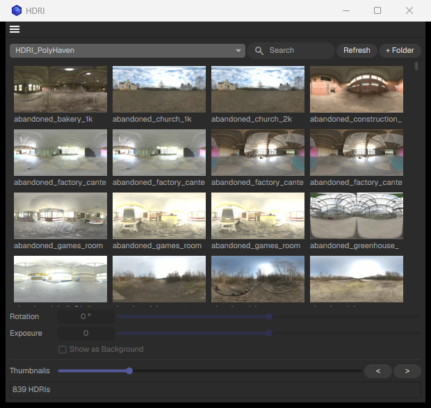

# Goodies

## Install
[Download](https://github.com/virakie/c4d-goodies/archive/refs/heads/main.zip), put the **Goodies** folder in your C4D `plugins` folder (Preferences → Open Preferences Folder), restart. Tools are under **Extensions → Goodies**.

## Tools

###  Axis
Axis to the centre of the geometry. **Shift:** bottom centre.

###  Snap to Floor
Drops the selection onto the floor. **Shift:** live tag that keeps it there.

###  Solo
Solos the selection in viewport and render. Click again to restore. Can also be used with lighting workflow for solo-ing lights.

###  Camera Toggle
Flips between the scene camera and the editor camera.

###  Render Regions
Drag a render region in the viewport, save named regions, or fit one to the selection.

###  Rename
Blender-style rename popup. `Leg_##` numbers, `*_L` adds a suffix, `old>new` replaces.

###  Icon Color
Tints the selected objects' icons. **Shift:** display colour too. **Ctrl:** reset.

###  Image As Plane
Images to planes with matching materials (Redshift, Octane or Standard).

###  HDRI _(Redshift)_
Thumbnail browser for your HDRI folders. Click to light the scene. Thumbnails need [ffmpeg](https://ffmpeg.org/).

###  PuzzleMatte _(Redshift)_
Drag objects in, Build: one matte AOV per object, or RGB packs.

###  Localize Textures
Copies all textures next to the scene and relinks them.

## License
[MIT](LICENSE)
