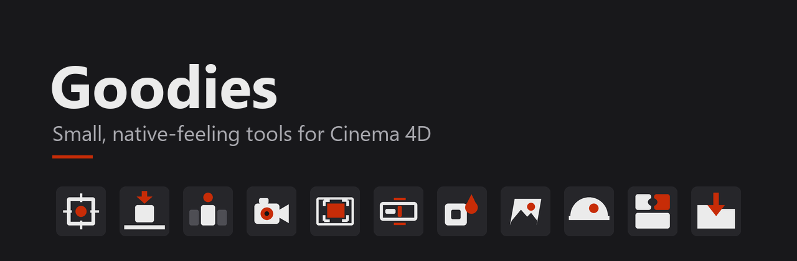
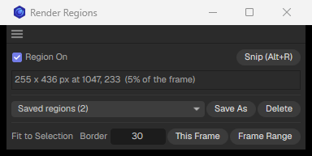

# Goodies

A small collection of Python plugins for Maxon Cinema 4D. Each one does one job, looks and feels like part of Cinema 4D, and stays out of your way: one click for the main action, Shift or Ctrl for its variant, messages in the status bar instead of popups, and one undo step for everything it changes.

Latest version: **1.0.0** _(27.09.2026)_ · [Change log](CHANGELOG.md)

## How to use

Written for **Maxon Cinema 4D 2026** (Python 3.11) and tested on Windows 11. They should work on macOS too, but that hasn't been tested.

_Use them at your own risk, and save your scene first._

### Installation
Download this [repo](https://github.com/virakie/goodies/archive/refs/heads/main.zip) and put the **Goodies** folder into Cinema 4D's plugins folder:

#### Windows
`C:\Users\<USER>\AppData\Roaming\Maxon\Maxon Cinema 4D 2026_<ID>\plugins`

#### macOS
`/Users/<USER>/Library/Preferences/Maxon/Maxon Cinema 4D 2026_<ID>/plugins`

The quickest way to find it: in Cinema 4D open **Preferences** (Ctrl+E / Cmd+E), press **Open Preferences Folder...** and go into `plugins` (create it if it's missing). Then restart Cinema 4D.

### Using the tools
Everything is under **Extensions → Goodies**. Click the dotted line at the top of that menu to tear it off into a palette you can dock anywhere.

Hold **Shift** or **Ctrl** while clicking a tool for its variant (listed below). Every tool can be given a shortcut in **Customize Commands** (Shift+F12). Some suggestions are listed with the tools.

Some tools remember settings (recent names, HDRI folders, favourites) in a `goodies_<tool>` folder inside Cinema 4D's prefs folder. Delete those folders too if you uninstall.

# Tools

## Modeling & Layout

###  Axis
**Default:** Moves each selected object's axis to the centre of its bounding box.
**Shift:** Moves the axis to the bottom centre instead.
Geometry and children stay exactly where they are, and rotation and scale are untouched. Objects with no geometry of their own (Nulls, groups) centre on everything below them. Parametric primitives, Symmetry, Lathe and Cloners are skipped, because moving their axis would change their shape; they're listed in the status bar.

###  Snap to Floor
**Default:** Drops the selected objects so their lowest visible point sits on the floor (world Y = 0).
**Shift:** Adds a live **Floor** tag that keeps them on the floor on every frame, even while they animate or deform. Shift+click again removes it.
Only position moves. Groups drop as one piece. The Floor tag has a **Floor Height** for floors that aren't at 0.

###  Solo
**Default:** Solos the selected objects in the viewport **and** the render. Click again to put everything back.
**Ctrl:** Forces a full restore.
Uses Cinema 4D's own layer solo, so the Layer Manager shows exactly what is soloed. Lights, environments and cameras stay on, so the scene still lights the same. Objects return to their original layers afterwards.

## Camera & Render

###  Camera Toggle
**Default:** Flips the active viewport between its scene camera and the editor camera, and remembers which scene camera to go back to.
Fast on heavy scenes: it only redraws the active view instead of re-evaluating the whole scene. The icon shows pressed while you're looking through a scene camera.

###  Render Regions
**Panel:** Region On, saved regions, and Fit to Selection.
**Snip Render Region** (give it a shortcut, e.g. Alt+R): drag a box in the viewport and that becomes the render region. Click without dragging to turn the region off, Esc to cancel.
- **Saved regions:** name them (Hero, Closeup…) and pick one to apply it again. They're stored in the scene as fractions of the frame, so they survive a resolution change.
- **Fit to Selection:** fits the region around the selected objects on **This Frame**, or around everywhere they go over the **Frame Range**, plus a border in pixels.
- A **Render Region Frame** helper draws the region in the viewport. It never renders.

Uses Cinema 4D's own render region, which Redshift follows exactly. (Cinema 4D's region can't be keyframed, so Frame Range makes one region that covers the whole move.)

## Organizing

###  Rename
**Default:** A one-line field pops up at the mouse with the selected object's name, Blender F2 style. Type, Enter to rename, Esc or click away to cancel. Suggested shortcut: a single key like **Q**.
- `Rock`: one object gets that name. Several become Rock_01, Rock_02…
- `Leg_##`: numbered in Object Manager order (`###` = three digits).
- `*_L`: `*` is the current name, so this adds a suffix (`Hero_*` adds a prefix).
- `old>new`: replaces text in every name (`old>` deletes it).

The first â–¾ menu has recent names; the second has **Clean Up Names** and **Auto-number Duplicates**. With auto-numbering on, a copy that Cinema 4D would call "Cube.1" becomes the next free "Cube_01" instead (big imports are left alone).

###  Icon Color
**Default:** Opens Cinema 4D's colour picker and tints the Object Manager icon of every selected object.
**Shift:** Tints the icon **and** the viewport display colour.
**Ctrl:** Resets them to default.

## Materials & Lighting

###  Image As Plane
**Default:** Pick one or more images; each becomes a plane sized to the image with a matching material.
Follows the scene's render engine: Redshift, Octane or Standard. Redshift materials use the image as colour and emission, so the plane shows the image as-is.

###  HDRI _(Redshift)_
**Panel:** Browse your HDRI folders as thumbnails and click one to light the scene with it.
**Shift+click:** Adds it as an extra dome instead of swapping.
**Right-click:** Add as new dome, favourites, show in Explorer.
- **+ Folder** adds an HDRI folder; collections, **Favorites** and **All** sit at the top of the list, with search.
- Only 2:1 panoramas are shown, so square light maps and gobos in the same folders stay out of the way.
- Rotation, exposure and "Show as Background" controls for the dome.
- Drop .hdr / .exr files from Explorer onto the panel to use them straight away.

Thumbnails are made in the background with [ffmpeg](https://ffmpeg.org/) if it's installed and on your PATH. Without it the panel still works, just without thumbnails.

_HDRIs shown: [Poly Haven](https://polyhaven.com/hdris) (CC0)._

###  PuzzleMatte _(Redshift)_
**Panel:** Drag objects in from the Object Manager (or **Add Selected**), then **Build**.
- **Per object** (default): one AOV per object, a plain white matte, e.g. `MATTE_Chair`.
- **RGB packs:** three objects per AOV, one per channel, e.g. `PM_Chair_Table_Lamp`.
- **Output:** Direct (each AOV writes its own file), Multi-Pass, or both.

Build gives each object an RS Object tag with its own Object ID and only ever replaces its own AOVs. A group becomes one matte. A child with its own Object ID override would punch a hole in its parent's matte; those rows are flagged and **Fix Conflicts** sorts them out. **Clear + Build** removes everything PuzzleMatte made.

###  Localize Textures
**Default:** Copies every texture and file the scene uses into a `tex` folder next to the .c4d, relinks the scene to it, and saves. Ready to zip and hand over.
Covers Redshift node textures, dome and gobo lights, Asset Browser textures and LUTs. The scene must be saved first. A confirmation shows how many files will be copied, are already local, or are missing. The .c4d is backed up to `backup\<name>_pre-localize.c4d` before saving. Running it again changes nothing.

## License
[MIT](LICENSE). Free to use, change and share, including commercially.
